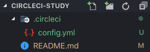

### circleci-study

---

### Intro

'배포 자동화를 도입해볼까?' 하고 찾아보다가 `circleci` 를 도입해보자! 라는 생각으로 시작된 공부입니다.

자세한 내용은 [공식문서](https://circleci.com/docs/)를 참고해주세요.

### Configuring CircleCI

CircleCI를 도입하기 위해 가장 먼저 해야할 점은, 진행중인 프로젝트에 **폴더**를 만드는 것입니다. 

1. root directory에 `.circleci`  폴더 생성
2. 해당 폴더 아래,  `config.yml` 파일 생성

다음과 같은 폴더구조를 가진다.

그렇다면 본격적으로 `config.yml` 작성법에 대해 알아봅시다. 이 예제는 **NodeJS**를 기반으로 작성하였으며, `build` `test` `deploy` 세 단계의 **job**을 예제로 작성해보았습니다.

---

### Version

버전은 꼭 작성해야하며, 기본적으로 **2.0 버전**을 사용합니다.

 `orbs`, `commands`, `executors` 와 같은 작업은 **2.1 버전**을 필요로 합니다. 

~~~yml
version: 2.1
~~~

### Jobs

circleci는 1개 이상의 job을 수행합니다. 수행할 작업은 모두 `jobs`에서 정의되어야합니다.  `jobs`는 다음과 같은 구조를 가집니다.

~~~yaml
jobs
  <job_name>
    docker
      steps
        run
        checkout
        save_cache
        restore_cache
        deploy
        persist_to_workspace
        attach_workspace
~~~

(jobs가 가질 수 있는 속성들 중에 예제에 사용하는 속성들로 재구성하였습니다. [전체 속성 확인하기](https://circleci.com/docs/2.0/configuration-reference/#jobs)) 

만약  **Workflows**를 사용한다면, jobs에는 유일한 이름이 있어야합니다 . **Workflows**를 사용하지 않는다면, `build` 라는 이름을 가진 job을 꼭 포함해야합니다. 

#### docker

circleci 2.X 버전의 장점은 `docker`를 natvie로 지원하는 점입니다. 저는 **node 8.10 버전**으로 주로 개발을 해왔기 때문에 다음과 같이 작성해주었습니다. circleci에서 제공하는 docker image는 [여기서](https://hub.docker.com/u/circleci) 확인할 수 있으니, 각자 개발 환경에 맞춰 작성해주시면 됩니다.

~~~yml
jobs:
  build:
    docker:
      - image: circleci/node:8.10
~~~

또한 각자 필요에 따라  `dockerfile`를 작성해 사용할 수 있습니다.

#### steps

앞서 우리가 docker image로 사용한 **circleci/node:8.10**에는 **Yarn**이 미리 설치되어있기에  **Yarn** 설치과정은 생략해도 됩니다. 총 3단계의 **job**을 작성해보았고, `build` `test` `deploy` 로 구성되어 있습니다. 

1. **install**

가장 먼저 진행되어야하는 작업은 패키지 설치/업데이트입니다.

~~~yml
jobs:
  install:
    steps:
      - run:
        name: install
        command: yarn install

~~~

 **Yarn** 을 사용하는 가장 중요한 점은 `cache` 입니다. Yarn 패키지는 캐싱을 통해 CI 빌드 시간을 단축시켜줍니다. 따라서 다음 코드를 추가해줍시다.

~~~yml
#...
      - restore_cache:
          name: Restore Yarn Package Cache
          keys:
            - yarn-packages-{{ checksum "yarn.lock" }}
      - run:
          name: Install Dependencies
          command: yarn install --frozen-lockfile
      - save_cache:
          name: Save Yarn Package Cache
          key: yarn-packages-{{ checksum "yarn.lock" }}
          paths:
            - ~/.cache/yarn
#...
~~~

2. **test**

이 작업은 optional입니다. 진행했던 프로젝트에서 **Jest**를 사용한 unit test를 적용했었기에, 이 과정을 거쳤습니다.

한가지 주의해야할 점은 `package.json`에 `scripts` 를 정의해야지만 아래와 같이 `command` 를 실행할 수 있습니다. 

~~~json
// package.json
{
  "scripts": {
    "test": "jest"
  }
}
~~~

~~~yml
# config.yml
jobs:
  test:
    steps:
      - run:
        name: running tests
        command: yarn run test
~~~

3. **deploy**

앞 단계와 마찬가지로, `package.json`에 `scripts` 정의하여 `yarn deploy` 를 정의합니다.

~~~json
// package.json
{
  "scripts": {
    "build": "node build-project.js",
    "deploy": "yarn build && yarn run publish"
  }
}
~~~

~~~yml
# config.yml
jobs:
  deploy:
    steps:
      - run:
        name: deploy!
        command: yarn deploy
~~~

### Workflows

`workflow`는 `jobs`에 정의된 모든 것을 조합해서 사용할 수 있도록 해줍니다. Workflow 또한 유일한 이름을 가지고 있어야하며, 다음과 같은 구조를 가집니다.

~~~yml
workflows
  version
    <workflow_name>
      jobs
        <job_name>
          requires
          filters
~~~

(workflow가 가질 수 있는 속성들 중에 예제에 사용하는 속성들로 재구성하였습니다. [전체 속성 확인하기](https://circleci.com/docs/2.0/configuration-reference/#workflows)) 

예상한 작업 시나리오는 다음과 같습니다.

- 모든 branch에서는 `test` 를 거친다.
- **master** branch에서는 `test`를 통과한 경우에만 `deploy`를 진행한다.

위와 같은 단계적 실행은 **workflow**를 통해 실행할 수 있습니다. 

#### Version

~~~yml
workflows:
  version: 2.1
~~~

job에서 사용하는 버전과 같은 버전을 사용하면 됩니다.

#### <Workflow_name>

workflow는 1개 이상으로 구성됩니다. 위와 같은 시나리오를 거치기 위해서는 총 3단계가 필요합니다. 

**모든 branches**:  `install` :arrow_forward: `test`

**master branch**: `install` :arrow_forward: `test` :arrow_forward: `deploy`

`build-test-deploy` 라는 이름을 가진 workflow를 작성한다고 가정해봅시다. **Jobs**는 기본적으로 병행되므로, 위와 같이 단계를 거치게 될 경우, **requires** 옵션을 꼭 적어주어야합니다. 

 

1. **install**

`install`은 모든 작업의 초기 단계이므로, 따로 옵션을 필요로 하지 않습니다.

2. **test**

`test` 는 `install` 이 성공하였을 경우에만 실행되는 job이므로 **requires** 옵션을 필요로 합니다. 

3. **deploy**

`deploy` 는 `install` 과 `test` 가 모두 성공하였을 경우에만 실행되어야 하므로 **requires** 옵션을 필요로 하며, **master  ** branch에서만 실행되어야 하므로 **filter** 에 **branches** 옵션을 필요로 합니다.

`only`와 일치하는 branches들만 `deploy` 를 실행하고 `ignore`과 일치하는 branches들만 `deploy` 를 실행하지 않도록 설정할 수 있습니다.

~~~yml
workflows:
  version: 2.1

  build-test-deploy:
    jobs:
      - install
      - test:
          requires:
            - install
      - deploy:
          requires:
            - install
            - test
          filters:
            branches:
              only: master
~~~
