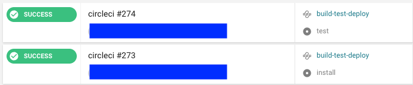
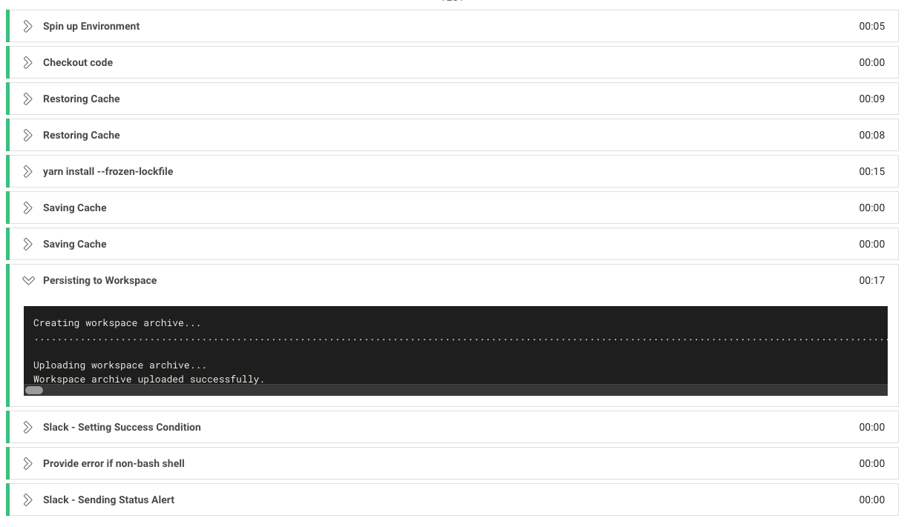
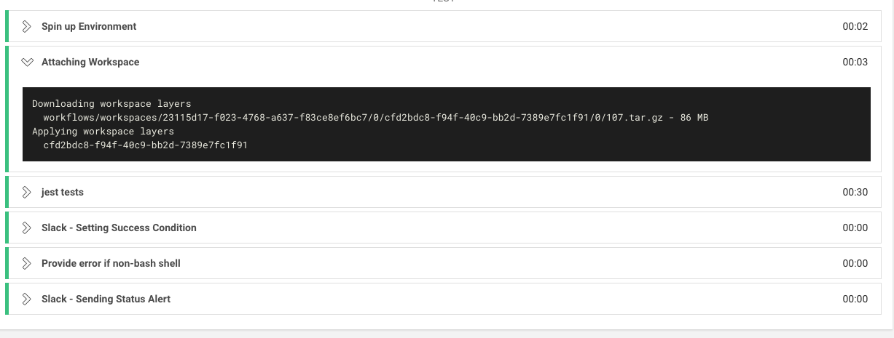

## Workflow Job 간의 파일 공유하기

아래 예제는 [1. confing.yml 파일 작성하기](./configfile.md) 와 이어지므로 앞의 예제를 꼭 읽어주세요. workflow를 사용하게 되면, 정의한 job들간의 파일 공유가 필요한 경우가 생깁니다. 이것을 도와주는 속성이 바로 `persist_to_workspace` 입니다. 

~~~yml
workflows:
  version: 2.1

  build-test-deploy:
    jobs:
      - install
      - test:
          requires:
            - install
      - deploy:
          requires:
            - install
            - test
          filters:
            branches:
              only: master
~~~

`.circle/config.yml`를 실행하면 workflow에서 정의한대로, `install` :arrow_forward: `test` 순서로 job이 실행됩니다. 

workflow를 통해 job을 나누게 되면, 각각의 job은 격리된 상태로 다른 job에서 생성된 파일은 보이지 않습니다. 각 job마다 매번 checkout을 정의하는 것은 비효율적이므로 이때 `persist_to_workspace`  속성을 통해 job간의 파일을 공유할 수 있습니다. 

- `persist_to_workspace`: 지정한 패스의 데이터를 일시적으로 보관해준다.
- `attach_workspace`: 보관한 데이터를 보여준다.

따라서 `.circle/config.yml` 을 다음과 같이 변경해봅시다. (`deploy` job은 생략하였습니다.)

~~~yaml
version: 2.1
jobs:
  install:
    working_directory: ~/project_name #해당 프로젝트의 이름을 적어주면 된다.
    docker:
      - image: circleci/node:8.10
    steps:
      - checkout
      - restore_cache:
          key: yarn-v1-{{ checksum "yarn.lock" }}-{{ arch }}

      - restore_cache:
          key: node-v1-{{ checksum "package.json" }}-{{ arch }}

      - run: 
          name: yarn install
          command: yarn install --frozen-lockfile

      - save_cache:
          key: yarn-v1-{{ checksum "yarn.lock" }}-{{ arch }}
          paths:
            - ~/.cache/yarn

      - save_cache:
          key: node-v1-{{ checksum "package.json" }}-{{ arch }}
          paths:
            - node_module

      - persist_to_workspace:
          root: .
          # workspace의 root path (.을 적어주면 working_directory에 적힌 설정을 그대로 따른다.)
          paths:
            - . 
          # 공유할 path

    test:
      working_directory: ~/project_name
      docker:
        - image: circleci/node:8.10
      steps:
        - attach_workspace:
          at: .
          # 위에서 지정한 workspace를 붙여준다.

        - run:
          name: jest tests
          command: yarn run test include
~~~

CircleCI 실행 결과를 확인해보면 `install` :arrow_forward: `test` 순서로 성공적으로 실행된 것을 볼 수 있습니다.

그렇다면 각 job의 실행결과를 확인해봅시다.

- **install 실행 결과**

(slack notification은 [여기서](./slackorb.md) 공부할 수 있습니다.)

정의된 step에 따라 실행되는 것을 확인할 수 있다. `persist_to_workspace` 속성을 통해 데이터를 일시적으로 보관해줍니다.

- **test 실행 결과**

`attach_workspace` 속성을 통해 보관된 데이터를 가져오는 것을 확인할 수 있습니다. `test` 작업에서 `yarn instsall` 작업을 또 실행할 필요없이, 바로 jest tests 명령어를 실행할 수 있습니다. 

### Code의 중복을 최소화하기

위에 적힌 예시를 보면 중복되는 작업이 몇가지 있는 것을 확인할 수 있습니다. 바로 `docker` 속성과 `working_directory` 속성입니다. 다음과 같이 **공통되는 속성**들은 새로 정의하여 코드의 중복을 줄일 수 있습니다.

~~~yaml
defaults: &defaults
  working_directory: ~/project_name
  docker:
    - image: circleci/node:8.10

attach_workspace: &attach_workspace
  attach_workspace:
    at: .
    
version: 2.1
jobs:
  install:
    <<: *defaults
    steps:
      # ...

  test:
    <<: *defaults
    steps:
      - *attach_workspace
      - run
      # ...
~~~

