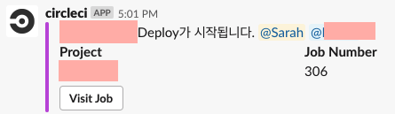
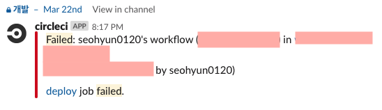
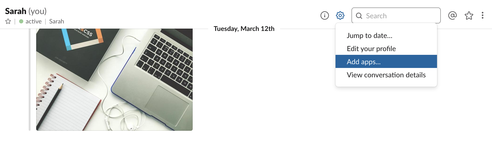
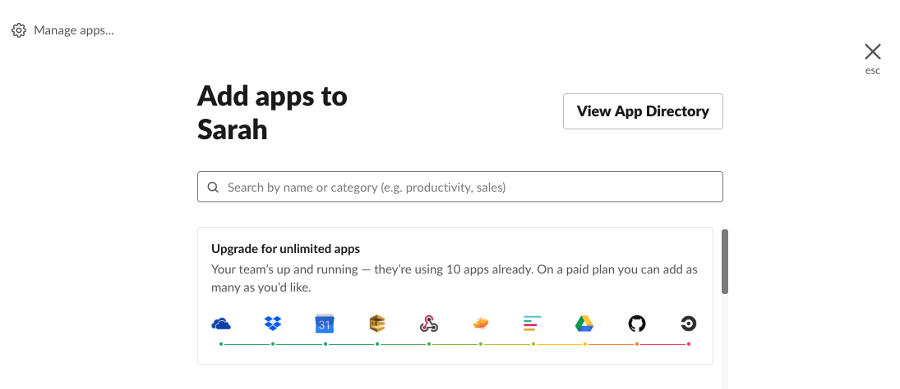
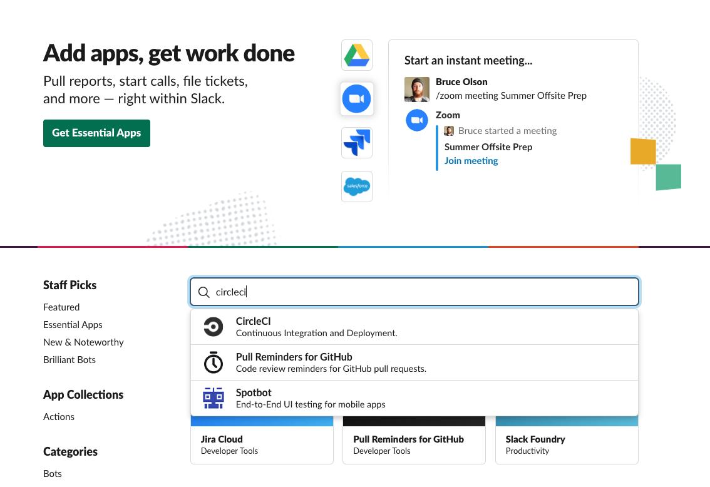
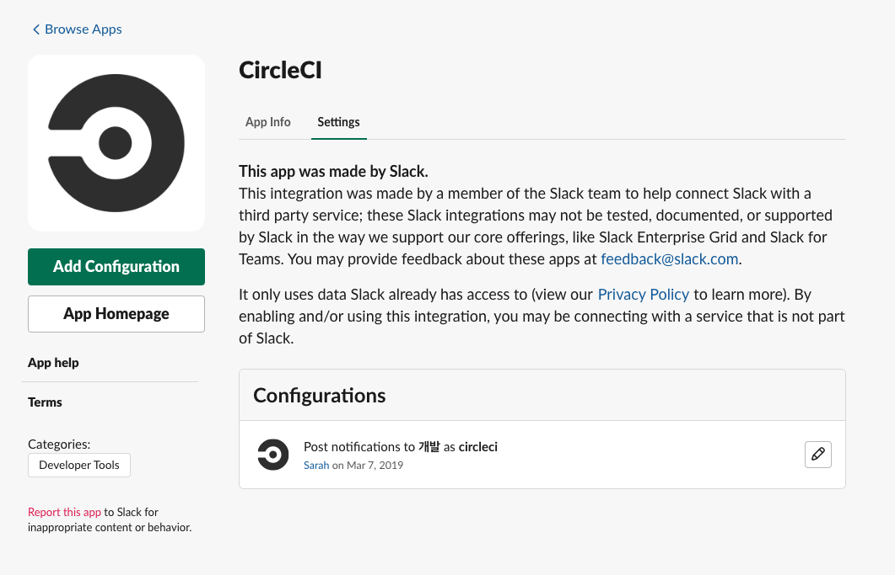
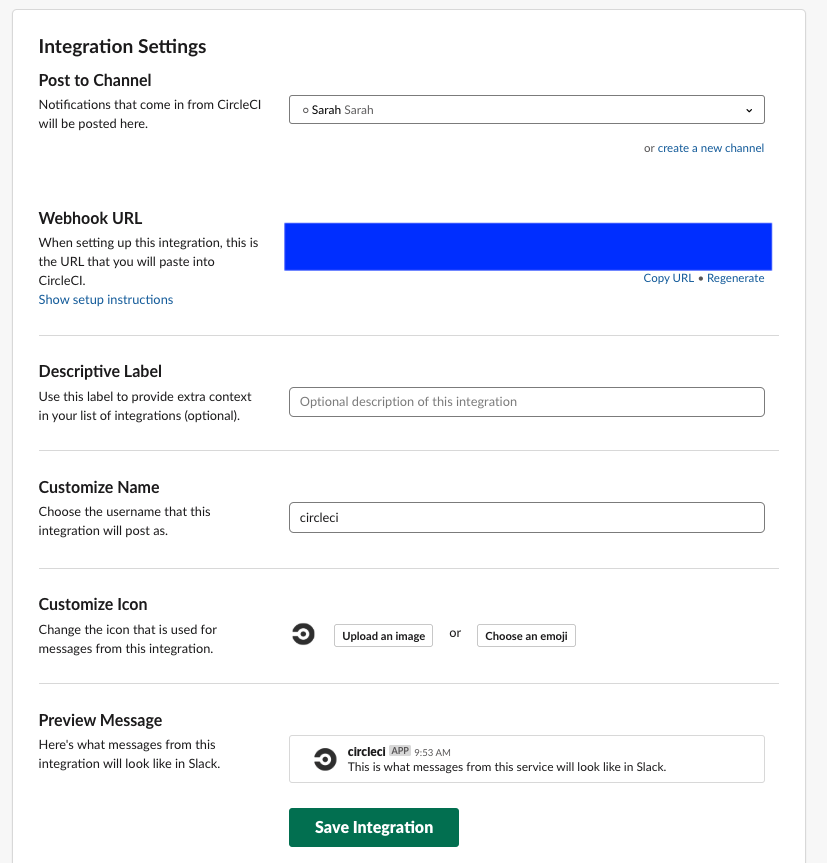

## Slack으로 알림 받기

CircleCI에 Slack 알림을 추가하여 빠르게 알림을 받을 수 있습니다. 메세지를 자체적으로 수정할 수 있는 장점이 있습니다. 

공식문서는 아래를 참고해주세요. **(3월 28일자 현재 버전: 2.1.0 )**

- [circleci/slack@2.1.0](<https://circleci.com/orbs/registry/orb/circleci/slack>)
- [github/slack-orb](<https://github.com/CircleCI-Public/slack-orb>)


그렇다면 본격적으로 알림을 어떻게 받을 수 있는지 알아봅시다. Orb를 사용하기 위해서는 CircleCI 버전이 **2.1** 이상이어야합니다. 

```yaml
version: 2.1
orbs:
  slack: circleci/slack@2.1.0
```


CircleCI의 알림을 받는 방식은 **Notfiy와** **Status로** 2가지가 있습니다.

### Notify

Notfiy는 job이 실행되는 **그 어떤 시점**에서도 커스텀된 메세지를 받아볼 수 있습니다. 한 개의 job에는 여러 단계(step)을 거칠 수 있는데, step의 중간 중간에 Notify를 받아볼 수 있습니다. 

Example:

```yaml
jobs:
  build:
    docker:
      - image: <docker image>
    steps:
      - slack/notify:
          message: "커스텀된 메세지입니다." # 커스텀할 내용을 작성해주세요. 
          mentions: "USERID1,USERID2," # mention할 유저의 memberID를 적어주세요. (slack profile에서 확인할 수 있습니다.)
          color: "#42e2f4" # 각 알림의 색깔을 지정해주세요. 
          webhook: "webhook_url_주소" # slack에서 발급받은 webhook url을 적어주세요. (발급받는 방법은 밑에서 자세히 확인할 수 있습니다.)
```

위의 변수들은 사용자가 선택할 수 있으며, 더 많은 옵션들을 지정할 수 있습니다. [공식문서](<https://github.com/CircleCI-Public/slack-orb>) 여기를 참고해주세요.




저는 주로 작업이 시작되기 전에 알림을 한번 받도록 하였고 작업이 성공하였을 때, 알림을 한번 더 받을 수 있도록 구성해보았습니다. 

### Status

Status는 job 실행의 성공 여부를 알려줍니다. 따라서 **반드시** job의 가장 **마지막** 단계가 되어야합니다. 

Example:

```yaml
jobs:
  build:
    docker:
      - image: <docker image>
    steps:
      # With fail_only set to true, no alert will be sent in this example. Change the exit status on the next line to produce an error.
      - run: exit 0

      - slack/status:
          mentions: "USERID1,USERID2," # mention할 유저의 memberID를 적어주세요. (slack profile에서 확인할 수 있습니다.)
          fail_only: "true" # Optional: "true"로 되어있을 경우, job이 실패했을 때만 메세지를 전송합니다.
          webhook: "webhook_url_주소" # slack에서 발급받은 webhook url을 적어주세요. (발급받는 방법은 밑에서 자세히 확인할 수 있습니다.) 
          only_for_branch: "master" # Optional: 특정 브랜치에서만 실행합니다.
```


해석하자면 만약 `master` 브랜치에서  `build` 작업이 실패할 경우, `USERID1`, `USERID2`에게 mention을 날리고 해당 채널에 알림을 보냅니다.

위의 변수들 역시 사용자가 선택할 수 있으며, 더 많은 옵션들을 지정할 수 있습니다. [공식문서](<https://github.com/CircleCI-Public/slack-orb>) 여기를 참고해주세요.



다음과 같이,  `deploy` 작업이 실패했을 때, slack에서 다음과 같은 알림을 볼 수 있습니다.


저는 Master와 Develop과 같은 중요한 브랜치에서는 성공여부와는 상관없이 모든 작업이 알림을 받을 수 있도록 구성하였고 그 외의 브랜치에서는 **status** 를 사용하여 실패했을 때만 알림을 받도록 구성했습니다. 자유롭게 커스텀해서 slack에서 알림을 받아보세요!

---

#### Webhook Url 확인하는 방법

Slack workspace안에는 여러 채널이 있습니다. 알림을 받고 싶은 채널을 지정하기 위해 slack에 circleci app을 추가해봅시다. 

1. 해당 workspace의 주소로 접속해주세요.

   ex) <https://해당_workspace_주소/apps>

2. 주소를 모르겠다면, 본인과의 DM창(혹은 다른 채널, DM창도 가능)에 들어와 톱니바퀴를 누르고, **Add apps...** 메뉴를 클릭합니다.

   

3. 우측 상단에 View App Directory 버튼을 눌러주세요. 하단에는 저희 채널에서 사용중인 App들을 볼 수 있습니다.

   

4. **CircleCI**를 검색해주세요.

   

5. 왼쪽 **Add Configuration** 버튼을 눌러주세요.

   

   저희 팀은 현재, `개발` 채널에서 circleci 알림을 받아보고 있습니다. 알림을 받고자 하는 Channel을 선택한 후, **Add CircleCI Integration** 버튼을 눌러주세요.

   

6. **Setup Instructions** 단계는 설명에 따라 하면 됩니다. **Integration Settings** 에서는 알림 받고자 하는 채널을 선택하고 생성된`Webhook URL`을 복사해둡니다. 마지막으로 **Save Integration** 버튼을 누르면 기본 세팅은 끝났습니다.

   

   